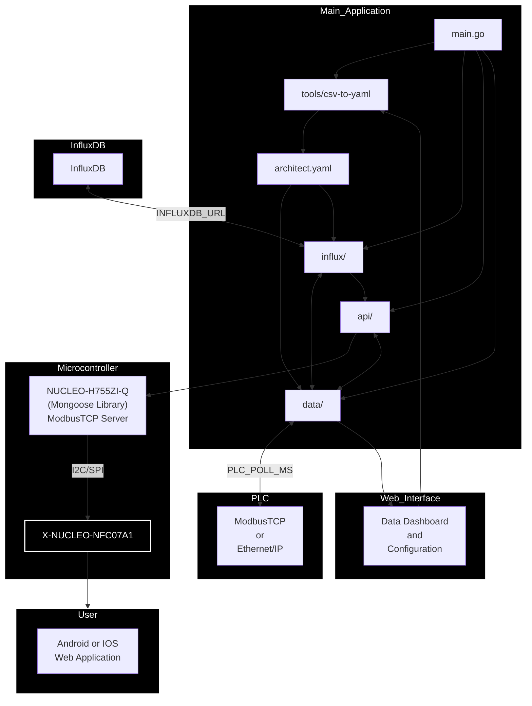

```mermaid
flowchart TD
    subgraph Main_Application
        main_go["main.go"]
        api["api/"]
        data["data/"]
        influx["influx/"]
        tools["tools/csv-to-yaml"]
        architect_yaml["architect.yaml"]
    end

    subgraph PLC
        plc_conn["ModbusTCP <br> or <br> Ethernet/IP"]
    end

    subgraph InfluxDB
        influxdb["InfluxDB"]
    end

    subgraph Web_Interface
        web_config["Data Dashboard <br> and <br> Configuration "]
    end

    subgraph Microcontroller
        microcontroller["NUCLEO-H755ZI-Q <br> (Mongoose Library) <br> ModbusTCP Server"]
        NFC["X-NUCLEO-NFC07A1"]
    end

    subgraph User
        android["Android or IOS <br>Web Application"]
    end

    main_go --> tools
    main_go --> influx
    main_go --> api
    main_go --> data

    data <-- "PLC_POLL_MS" --> plc_conn
    data --> web_config
    api --> microcontroller
    api <--> data

    influxdb <-- "INFLUXDB_URL" --> influx
    influx <--> data
    influx --> api

    tools --> architect_yaml
    architect_yaml --> data
    architect_yaml --> influx

    microcontroller -- "I2C/SPI" --> NFC
    NFC --> User

    web_config --> tools

    style Main_Application fill:#000,stroke:#fff,color:#fff,stroke-width:2px
    style PLC fill:#000,stroke:#fff,color:#fff,stroke-width:2px
    style Web_Interface fill:#000,stroke:#fff,color:#fff,stroke-width:2px
    style InfluxDB fill:#000,stroke:#fff,color:#fff,stroke-width:2px
    style Microcontroller fill:#000,stroke:#fff,color:#fff,stroke-width:2px
    style NFC fill:#000,stroke:#fff,color:#fff,stroke-width:2px
    style User fill:#000,stroke:#fff,color:#fff,stroke-width:2px
```
