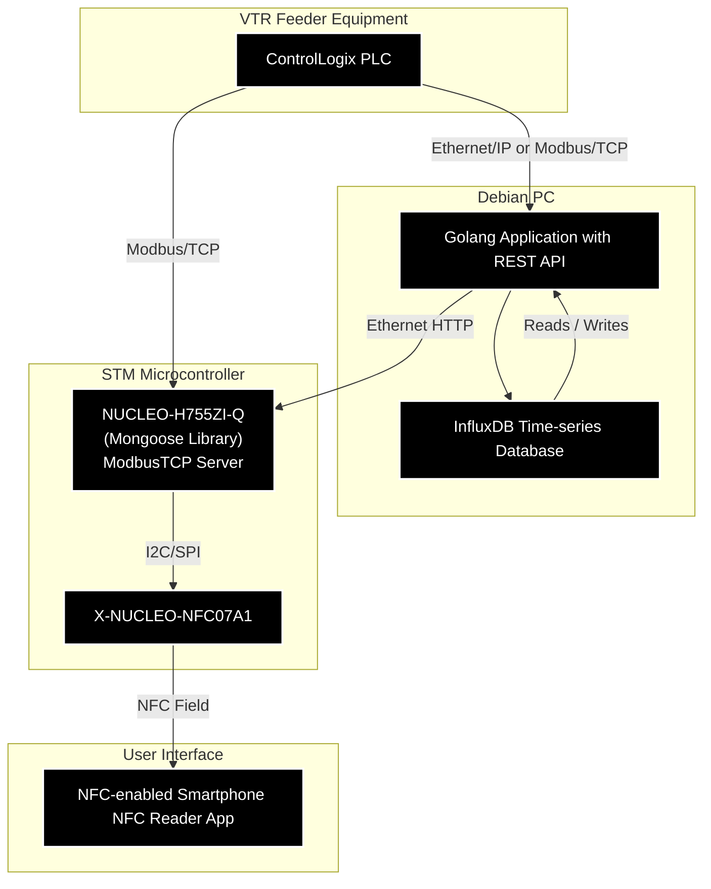

```mermaid
graph TD
    subgraph VTR Feeder Equipment
        PLC["ControlLogix PLC"]
    end

    subgraph Debian PC
        PC_App["Golang Application with REST API"] --> InfluxDB["InfluxDB Time-series Database"]
    end

    subgraph STM Microcontroller
        NUCLEO["NUCLEO-H755ZI-Q <br> (Mongoose Library) <br> ModbusTCP Server"]
        NFC_Board["X-NUCLEO-NFC07A1"]
    end

    subgraph User Interface
        Smartphone["NFC-enabled Smartphone NFC Reader App"]
    end

    PLC -- "Ethernet/IP or Modbus/TCP" --> PC_App
    InfluxDB -- "Reads / Writes" --> PC_App
    PC_App -- "Ethernet HTTP" --> NUCLEO
    PLC -- "Modbus/TCP" --> NUCLEO
    NUCLEO -- "I2C/SPI" --> NFC_Board
    NFC_Board -- "NFC Field" --> Smartphone

    style PLC fill:#000,stroke:#fff,color:#fff,stroke-width:2px
    style PC_App fill:#000,stroke:#fff,color:#fff,stroke-width:2px
    style InfluxDB fill:#000,stroke:#fff,color:#fff,stroke-width:2px
    style NUCLEO fill:#000,stroke:#fff,color:#fff,stroke-width:2px
    style NFC_Board fill:#000,stroke:#fff,color:#fff,stroke-width:2px
    style Smartphone fill:#000,stroke:#fff,color:#fff,stroke-width:2px
```