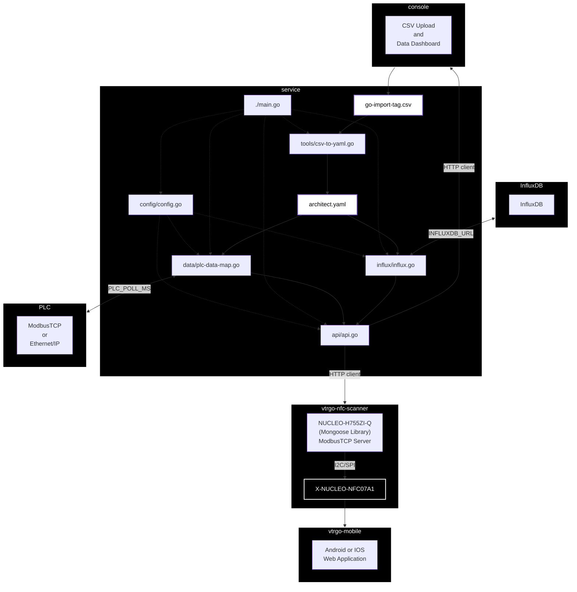

```mermaid
flowchart TD
    subgraph Architect["service"]
        main_go["./main.go"]
        api["api/api.go"]
        data["data/plc-data-map.go"]
        influx["influx/influx.go"]
        tools["tools/csv-to-yaml.go"]
        config["config/config.go"]
        architect_yaml["architect.yaml"]
        go_import_tags_csv["go-import-tag.csv"]
    end

    subgraph PLC
        plc_conn["ModbusTCP <br> or <br> Ethernet/IP"]
    end

    subgraph InfluxDB
        influxdb["InfluxDB"]
    end

    subgraph Web_Interface["console"]
        web_config["CSV Upload <br> and <br> Data Dashboard"]
    end

    subgraph Microcontroller["vtrgo-nfc-scanner"]
        microcontroller["NUCLEO-H755ZI-Q <br> (Mongoose Library) <br> ModbusTCP Server"]
        NFC["X-NUCLEO-NFC07A1"]
    end

    subgraph User["vtrgo-mobile"]
        android["Android or IOS <br>Web Application"]
    end

    config -.-> influx
    config -.-> data
    config -.-> api
    main_go -.-> config
    main_go -.-> tools
    main_go -.-> influx
    main_go -.-> api
    main_go -.-> data
    data --> api
    data <-- "PLC_POLL_MS" --> PLC
    api -- "HTTP client" --> Microcontroller
    api -- "HTTP client" --> Web_Interface
    influx --> api
    tools --> architect_yaml
    architect_yaml --> data
    architect_yaml --> influx
    microcontroller -- "I2C/SPI" --> NFC
    InfluxDB <-- "INFLUXDB_URL" --> influx
    NFC --> User
    Web_Interface --> go_import_tags_csv
    go_import_tags_csv --> tools

    style Architect fill:#000,stroke:#fff,color:#fff,stroke-width:2px
    style PLC fill:#000,stroke:#fff,color:#fff,stroke-width:2px
    style Web_Interface fill:#000,stroke:#fff,color:#fff,stroke-width:2px
    style InfluxDB fill:#000,stroke:#fff,color:#fff,stroke-width:2px
    style Microcontroller fill:#000,stroke:#fff,color:#fff,stroke-width:2px
    style NFC fill:#000,stroke:#fff,color:#fff,stroke-width:2px
    style User fill:#000,stroke:#fff,color:#fff,stroke-width:2px
    style architect_yaml fill:#fff, color:#000,stroke-width:2px
    style go_import_tags_csv fill:#fff, color:#000,stroke-width:2px
```
