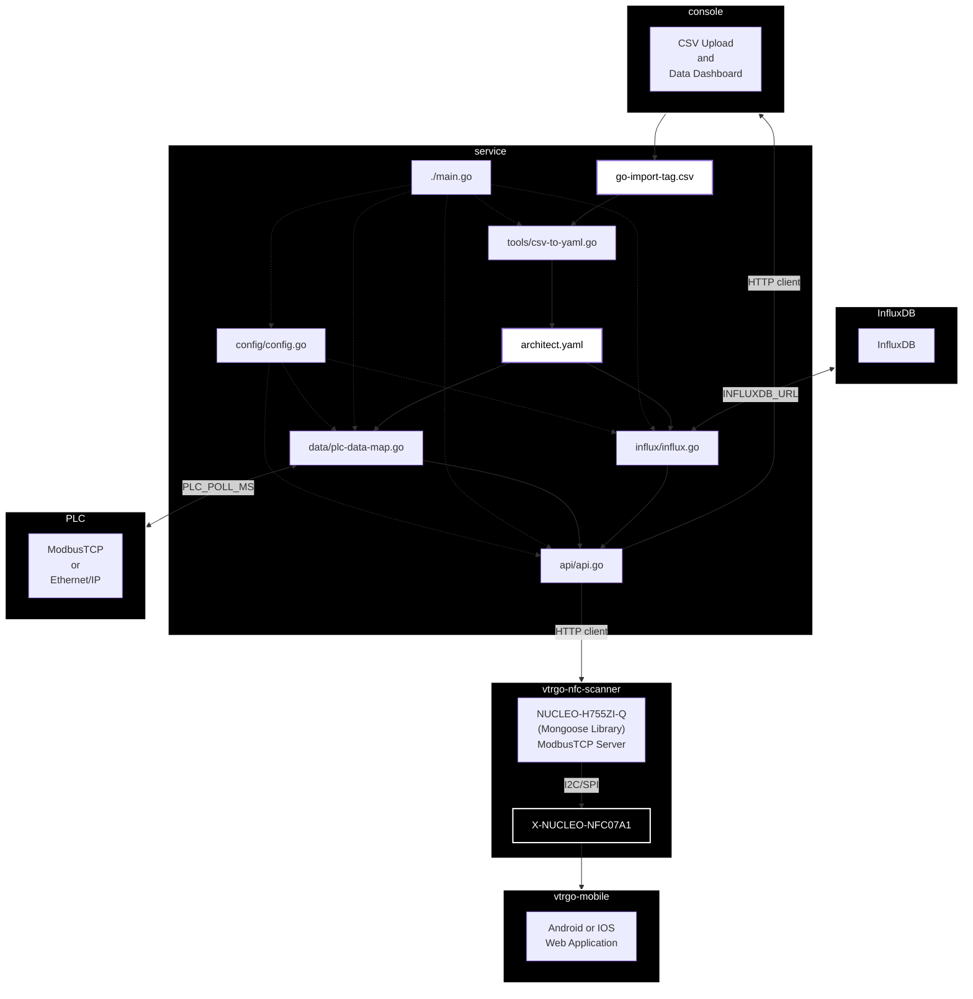

# [vtrgo-data-dashboard](https://github.com/vtrgo/vtrgo-data-dashboard)

vtrgo-data-dashboard is a full-stack application for industrial data monitoring. It consists of a Go-based backend service and a React-based frontend console.

## [Service](./service)

A backend service for industrial data acquisition, processing, and visualization. It connects to Programmable Logic Controllers (PLCs) via Modbus TCP or Ethernet/IP, interprets the data using a flexible YAML configuration, logs it to InfluxDB for historical analysis, and exposes a RESTful API for the frontend.

## [Console](./console)

A modern, responsive web-based dashboard for visualizing industrial data collected by the service. It provides real-time and historical insights into machine status, faults, and performance metrics through an intuitive, newspaper-themed interface. This application is built with React, TypeScript, and Vite.

---

## Companion Applications

- **[vtrgo-nfc-scanner](https://github.com/vtrgo/vtrgo-nfc-scanner)**: A microcontroller-based application for scanning NFC tags and interacting with the data service.
- **[vtrgo-mobile](https://github.com/vtrgo/vtrgo-mobile)**: A mobile application for viewing dashboards and receiving alerts.

## Architecture

A high-level overview of the system architecture. See [MERMAID.md](./MERMAID.md) for the raw diagram source.

---
